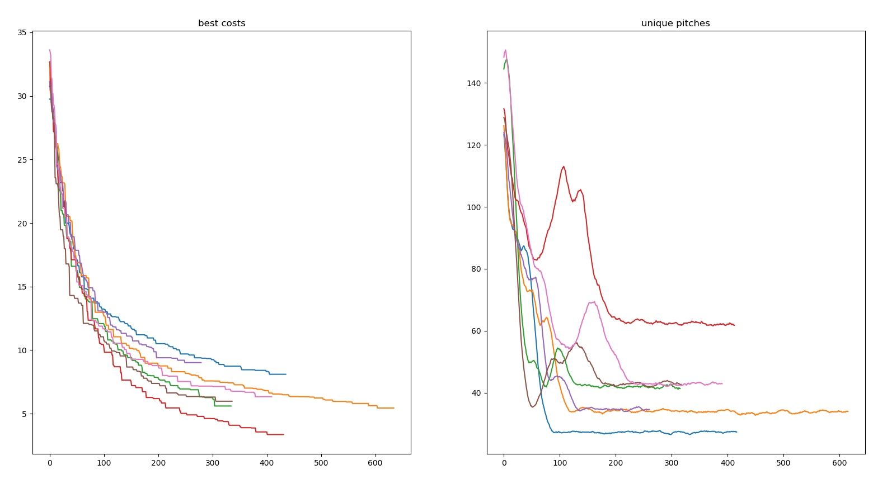

+++
title = "Assigning students to semester projects"
date = 2021-09-05
description = "My attempt at solving a real world problem in a game creation school !"
[extra]
topic = "Evolutionnary algorithm"
kind = "Useful"
repository = "https://github.com/Inspirateur/PitchAssignment"
+++

A friend of mine studying at a video game creation school once told me about the following situation:  
For a school project, students had to come up with video game ideas, pitch them to a jury, and then team up to make working prototypes for those pitch. Since there was more pitches than what was possible to make, the pitches also had to be selected. The solution in place was in 2 stages: 
  1. Students rate the pitches which are then sorted by avg rating and trimmed down so that a manageable number of pitches is left.
  2. Students make a wishlist of up to 6 pitches they want to work on, and then they are manually assigned by a comitee of students in Project Management. 

While this may seem like a sensible solution at first glance, it definitely has some issues that my friend wasn't satisfied with. The first vote of selection is harmful and un-needed in the process: it may leave out game ideas backed by a full team of students just because it isn't appreciated as much by the others, and it may also select game ideas that no developper want to work on just because it was popular among game designers and artists. 
The second step is also not ideal, because manual assignment is prone to human error and unfairness.

Understanding this, I took the challenge to make a software that would solve this problem more appropriately. Let's dive into how I went about it and how we tried it out for real the following year!

## The stable marriage problem
So we want to assign students to projects based on their preferences and such that the game ideas are sufficiently staffed to be made into a prototype.
If we take a look at the existing problems related to what we're doing we find that this kind of pairing problem has been heavily studied already! As an introduction to the field, we find the [stable marriage problem](https://en.wikipedia.org/wiki/Stable_marriage_problem) (sorry for the heteronormativity):
> Given `n` men and `n` women, where each person has ranked all members of the opposite sex in order of preference, marry the men and women together such that no 2 person prefer each other to their partner (the marriages are stable).

And associated to this problem, we are handed down the simple yet remarkably effective Gale-Shapley algorithm, that goes like this:

Repeat until everyone is paired:
1. Each unpaired man proposes to the woman he wants most (and that he hasn't proposed to yet)
2. Each woman (temporarily) selects the man she wants most out of the propositions she has

In this setting, there is an equal number of "proposants" (in this case men) and "acceptants" (in this case women), but this procedure is extendable to University acceptation problems, if we treat each available seat as an individual "acceptant". Additionnally, it offers us 2 strong guarantees:
- It's **stable**: no 2 person will prefer each other over their partner (thus solving the problem)
- It's **truthful**: being honnest about your preferences is the best strategy to get what you want! 

It's also worth noting that there are often multiples stable solutions and that the Gale-Shapley algorithm yields the best solution for the **proposing** group, so in the marriage example the men have it best. 
Both stability and truthfulness are highly desirable properties for our usecase of assigning students to projects, but with great guarantees come great restrictions ...

First, the stability breaks if we allow "same-sex marriage" (if the group of proposants is the same as the group of acceptants) because of [love triangles](https://en.wikipedia.org/wiki/Stable_roommates_problem#Solution). This is an interesting observation but it doesn't affect our use case, because students and project seats are 2 separate groups, so it's fine. 

The real bummer is the second restriction: if either group has no preferences the process is no longer truthful. You can see why this is the case in the marriage problem: if the women had no preferences for men then they would just stick with the first that proposed (no reason to swap) and men's wishlists would become strategic. This really hurts our plan, because the video game pitches have no preference for who makes them, there just needs to be enough developpers, artists, etc. to make a prototype. One way to get the truthfulness back would be to create random preferences towards the students but that would be unfair and we don't want that either.

For this reason and other concerns with flexibility, I chose not to continue with the Gale-Shapley algorithm even though it seemed to fit our needs at first. Maths are cruel.

## The bacteria
You might've guessed it with the topic of this article, the approach I turned to is evolutionnary algorithms. If you're unfamiliar, here's a very rough breakdown:

> 1. define a cost (or "fitness") function that quantifies how bad (or how good) a solution is
> 2. generate random solutions, evaluate them with the function
> 3. select the best solutions and tweak them to generate the next generation
> 4. rinse and repeat

This process mimics evolution in its simplest form and is often limited to asexual reproduction, like bacterias. It has the advantage of being very flexible because we can easily change the results by changing the cost function, but its incremental nature causes it to easily get stuck in local minimas. 

Let's explain step by step how I applied this framework to our initial problem.

### Inputs and Output
The inputs of our problem are the following:
- The students, divided in 6 specialties: game designers, programmers, artists, sound designers, UI/UX designers, project managers
- A set of video game ideas (pitches) and their associated workloads. Some prototypes may require more artists and some may require more programmers for example.
- The wishes of the students for what game idea they want to work on. It is a ranked list in the form of (pitch, role), some students might be candidate for multiple roles, for example a programmer with artistic talent could ask to work as an artist on a specific game.

The output that we need to produce is a repartition of every students on a selection of pitches such that:
1. every student is assigned to a (pitch, role) that was present in their wishlist (multi-tasking is allowed)
2. the pitches that end up being selected must have enough staffing so that they can be turned into prototypes
3. the wishes of the students must be respected as much as possible

Not all students will be able to have their first wish, and it's also possible that some projects end up slightly under/over staffed depending on the number of students.

In the evolutionnary framework we're building, any repartition of students that follows criteria 1. is called a "solution", and the cost function will reflect criteria 2. and 3.  

### The cost function
After a lot of tweaking, the cost function I ended up with is the following:  
Given a solution `s`, `cost(s) = α*p(s) + (1-α)*r(s)`, with:
- `p(s)` quantifies how much the preferences of the students are fulfilled by the solution `s`.  
  `p(s)` is computed by summing over the (normalized) ranks of all the wishes fulfilled by the solution, squared. The lowest cost is achieved if the solution grants the first wish of every student. The squaring is a common trick to bias the solution towards equality: the cost will be lower if everyone is a little unhappy than if a few are very unhappy. 
- `r(s)` quantifies how much the solution `s` respects the pitches requirements. Which includes:
  - deviation of the solution from the workload required by each pitch  
    (for example the solution will be penalized if there's not enough programmer on one pitch)
  - the cost of an author not having their role on their pitch.
  - the cost of students multi-tasking (working multiple roles or multiple pitches), which needs to be avoided if possible

The cost function is parametrized by α in [0, 1], which I call "flexibility",  
a greater α will give less importance to the requirements, 
and more importance to the preferences of the students.

There is also quite a few other parameters that help tweaking the results: penalty for multi-task, penalty for author not being on their pitches, etc. This is the strength of the evolutionnary approach, it is really easy to tweak the cost function to get what we want!

### Evolution
Now that we have properly defined the "solutions" and the cost function, we're ready to tackle the evolutionnary algorithm itself.

To start off the process, 200 (`population` parameter) random solutions are generated by granting a random wish (pitch, role) to every student, favoring wishes at the top of their list with a negative exponential distribution. Naturally, these random solutions are terrible, but it is only the first generation. The solutions are then ranked with the cost function (lowest cost are best), and all solutions under the top 10% (`diversity` parameter) are discarded. The population is then filled again, with mutated copies of the top 10%. Each solution is mutated 2 times (`mutation` parameter), by attributing another wish to 2 random students, sometimes without removing the previous role (to allow for multi-tasking). Throughout the generations, we keep track of the lowest cost that is achieved, and when this lowest cost stops improving for 200 generations (`patience` parameter) we stop the process and output the best solution that we got.

Parameters `population` and `patience` offer a trade-off between compute time and result quality, while `diversity` and `mutation` are evolution parameters that need to be tuned empirically to get the best results.

To debug the process I generated fake data and used a simpler cost function that would just sum the wish ranks that were granted while ignoring the pitches requirement, to verify that at the end every student got their first wishes. 

This algorithm is really crude and has some serious flaws that we'll go over in the next part, but it did produce decent solutions both on the fake data and on real world data when we tried it out with the game creation school!

### Experiments
So how does it fare? Well first off, it's kinda slow, like hours for a good solution. I wrote it in unoptimized python so that's no surprise, but it isn't the only thing slowing it down. 

A big issue is the selection of pitches. Since there's too many, the output of our program has to only contain a subset of pitches that was best given the wishes of the students. The cost function reflects that with a subtle but crucial tweak: if in a solution one of the video game idea has 0 students working on it, the cost is 0 because it's fine to leave out pitches; however, if the pitch instead has 1 student working on it then the cost is very high, because 1 student won't be enough to turn it into a prototype, so the configuration is bad.

This makes it really hard for our naive evolutionnary algorithm to change the selection of pitches, because if it randomly assigns a student to an unstaffed pitch, the cost instantly blows up and the solution is discarded. The fact that there's a wide variety of solutions at the start somewhat alleviates the problem, but a better way to deal with that would be to make the algorithm aware of the selection of pitches (instead of doing it implicitely with the cost function), and a new mutation could be introduced that changes the selection of pitches.

This effect of getting stuck on a pitch selection showed up in a unexpected way when I plotted the cost and diversity of the solutions over time:

First, we note that the most diverse runs yield the best results, which is intuitive and also stresses how big of an issue it is to get stuck with a given selection of pitches.
But then we also notice something weird: as the cost lowers, there's a diversity bump in each of the runs! 

I really struggled to understand that at first, I was thinking this might be some kind of phase transition, and was wondering if it was causing the cost to go lower. But it turned out the causality is in the other direction! When a solution randomly gets significantly better than the other by sheer luck, its offsprings can stay competitive even when they mutate 1 student on a precedently unstaffed pitch! This normally would get the offsprings eliminated, but their inherited advantage makes them survive a few rounds, thus making the overall diversity go up before going down again.

### Trying it out for real
Quite some months after I finished working on the project, I was contacted by a student in project management in the same school to try it out for real! I had trouble getting myself into the project again, but after some tinkering it started to output decent solutions on real data! The only problem was that the output contained too much multi-tasking students which they understandably didn't like, and I had trouble to improve this, because I was struggling with a bug and there was very little time left before the school deadline... ¯\\_(ツ)_/¯

In the end, I think the real value was thinking of this whole student assignment as an optimization problem with a cost function. But if I ever pick up the project again and upgrade the evolution process with better mutations and pitch selection awareness I'm sure it has potential to be useful! In any case it was fun, and a great learning experience; thank you for reading :)