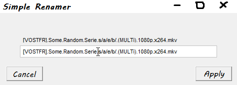

+++
title = "One renaming to rule them all"
date = 2021-11-20
description = "Batch renaming softwares have complicated UIs with tons of fields. Turns out you only need 1."
[extra]
topic = "Language Processing, UI"
kind = "Useful"
repository = "https://github.com/Inspirateur/SimpleRenamer"
+++

Often in my day to day life I am faced with a list of (totally legal) files that look like this:

> [VOSTFR].Some.Random.Serie.s1e1.(MULTi).1080p.x264.mkv  
[VOSTFR].Some.Random.Serie.s1e2.(MULTi).1080p.x264.mkv  
[VOSTFR].Some.Random.Serie.s1e3.(MULTi).1080p.x264.mkv  
...  

Or maybe a camera that's feeling very american yields me pictures with the format month-day-year_number.jpg

And whenever that happens to me I'm like *"urgh, I wish these were named differently but I'm too lazy to [regex](https://en.wikipedia.org/wiki/Regular_expression) it so I'll just leave them be."*. Or sometimes, when there's a small number of them, I'll rename them by hand and wonder *"is there really no simple tool that can do it for me ?"*. The pattern in the file names is usually very obvious, with some parts that are fixed and some that are variable (like episode/season numbers, or dates). 

I felt like it should be simple for a program to:

> 1. automatically identify those fixed and variable parts
> 2. provide you a template name in the form of:  
\> [VOSTFR].Some.Random.Serie.s`/a/`e`/b/`.(MULTi).1080p.x264.mkv  
with `/a/` and `/b/` representing variables in the file names
> 3. allow you to rename it to something like:  
\> Some Random Serie - S`/a/`E`/b/`.mkv
> 4. apply this renaming on files that follows this template

This hypothetical program would allow anyone to rename a batch of files without using regexes! So I looked for it, thinking this idea was too simple to not have already been implemented.

I couldn't find it.

Sure, there was some batch renaming freewares with [tons](https://www.bulkrenameutility.co.uk/assets/img-bru/mainscr.png) of functionnalities, but as far as I could see, all of them used Regex, and where way too complex for my purposes. I had a eureka moment when I found the native Windows feature to rename multiples file, quickly followed by disappointement when I realised that it was just giving every file the same name succeeded by a (n) denoting the number. 

Thus, in true programmer fashion, I spent 50+ hours making this program just to save myself a dozen seconds of renaming 😎.

## The first version
Going back to the rough plan I outlined, the first and biggest obstacle for our magical program is to automatically identify the fixed and variable parts given a list of file whose names follow a pattern. For the first version, I made a simplifying assumption: assume that all variables in file names are numbers. This is mostly true and covers our base case of episode/season numbers and dates. 

With this supposition, the code to identify the fixed and variable parts of file names is simple:
1. Split all file names around numbers, so our first example becomes:  
"[VOSTFR].Some.Random.Serie.s", "1", "e", "1", ".(MULTi).", "1080", "p.x", "264", ".mkv"  
"[VOSTFR].Some.Random.Serie.s", "1", "e", "2", ".(MULTi).", "1080", "p.x", "264", ".mkv"  
"[VOSTFR].Some.Random.Serie.s", "1", "e", "3", ".(MULTi).", "1080", "p.x", "264", ".mkv"  
...
2. The parts that vary are marked as variables (in our example only the episode number will be marked as variable, unless there's season 2 files in the selection)

I used Python for that, and made a basic UI with Tkinter to display the template name that was extracted, as well as a text field to edit the template:

  
<small>I had no screenshot of this version so I had to draw it, sorry 😅</small>  
The variables are represented with /a/ and /b/, I chose to use slashes to denote variables because it's a forbidden character in file names so there can be no confusion.
The user can then edit the template name, and every file is renamed following the new template, replacing the variables with their original value.

This worked pretty well, I made a cheesy little showcase [here](https://www.youtube.com/watch?v=ADsyiEJWdpU), made an .exe with [PyInstaller](https://pyinstaller.org/en/stable/usage.html) and posted it to reddit, satisfied.

But of course that wasn't the end of it 🙃. The assumption that all file name variables are numbers broke a use case that I kept running into: it doesn't work when episode titles are in the file names. Additionnaly, a redditor suggested that the program let us edit a real title instead of a template and I liked the idea so a year later I started working on a second version!

## The second version
So in this version, we want the program to be able to recognize title variables such as:

> [VOSTFR] Some Random Serie - S1E01 - The Beginning (MULTi) 1080p x264.mkv  
[VOSTFR] Some Random Serie - S1E02 - Trouble starts (MULTi) 1080p x264.mkv  
[VOSTFR] Some Random Serie - S1E03 - New Player (MULTi) 1080p x264.mkv  
...

But on the other hand, we don't want our program to associate unrelated files together just because they have words in common:  
> Big Game Hunter - meme.png  
Game_of_life_installer.msi  
Game of throne - a feast for crows.epub  
...

So there is a "sensitivity" balance in what gets recognized as a title variable and what is not. 
<small> Unrelated but I had to mention it somewhere: I wrote this version in Rust because that's a cool language I'm learning </small>

In order to solve this new problem, I changed the template extraction part to something like this:
1. The user selects a file to batch rename
2. every other file in the folder is compared to the selected file using [Difflib](https://github.com/DimaKudosh/difflib), giving me a matching score and identifying the fixed and variable parts
3. if the matching score is greater than 0.6 - an arbitrary sensitivity threshold found empirically - the 2 files are associated
4. shenaningans are done to unify the multiple rules extracted (this happens if 2 files have a common part by accident such as 2 "episode 01" from different seasons)

Slap some unit tests for debugging after some tweaking it did work!

Now the other big change left to do is allow the user to edit a real file name instead of a template with variables. The first idea that came to my mind was: 
1. use the inferred template to extract the values of variables on the file name that the user selected
2. in the new file name given to this file by the user, find those variable values again, to deduce the new template to apply to other file names

However, in a file name such as:  
`[1080p] Some Random Serie - S1E1 - The Beginning (MULTi.VOSTFR.x264).mkv`  
If the folder only contains season 1 (as if often the case), the 2 variables are "1" for the episode and "The Beginning" for the title. The title is fine but the value "1" appears 3 times in the file name! So if the user renames this file to this:  
`Some Random Serie - S1E1 - The Beginning.mkv`  
the program has to correctly deduce that the "1" coding the episode number is the 2nd one even though it was the 3rd one in the old file name! Simply assuming that the first "1" we see is the episode number won't cut it.

Thankfully, I came up with a relatively simple solution that works well in our case: taking the "fingerprints" of the variables, a count of all the characters that come before the variable value in the old file name. In the new file name we compare this print to the prints of every instance of the value ("1" in our example), and decide that the closest match is our variable.  
<small> closest match is based on Manhattan distance here but it's an implementation detail </small>  

In our example, the 1 that will be interpreted as our variable in the new file name is the correct one (the 2nd), because if you look at all the characters before it, it's the closest match for all the characters that came before our variable in the old file name, it is only missing the characters for "[1080p]" but so is the 1 from "S1", which is also missing the "E" of "E1".

Of course the fingerprint match is a [heuristic](https://en.wikipedia.org/wiki/Heuristic), the user is the only one to know what they meant with their file renaming, but it does work well in practice and requires very little computation.

### Demo
So this is more or less how the second version works. Now here's the cool demo showcasing its power 😎

In this new interface I added a live preview of what the new titles would become if the renaming was applied, very useful when the program does not work as intended. 😅

More importantly, I'm able to do something that wasn't possible before! In this demo there's 2 episode titles, the first one is in french some of the time (idk why), and the 2nd one (in parenthesis) is always in english. Both are recognized as title variables, and in the demo I'm able to get rid of the first one successfully!

I'm now really happy with the results and can switch on to maintenance mode for this project, thanks for reading :)